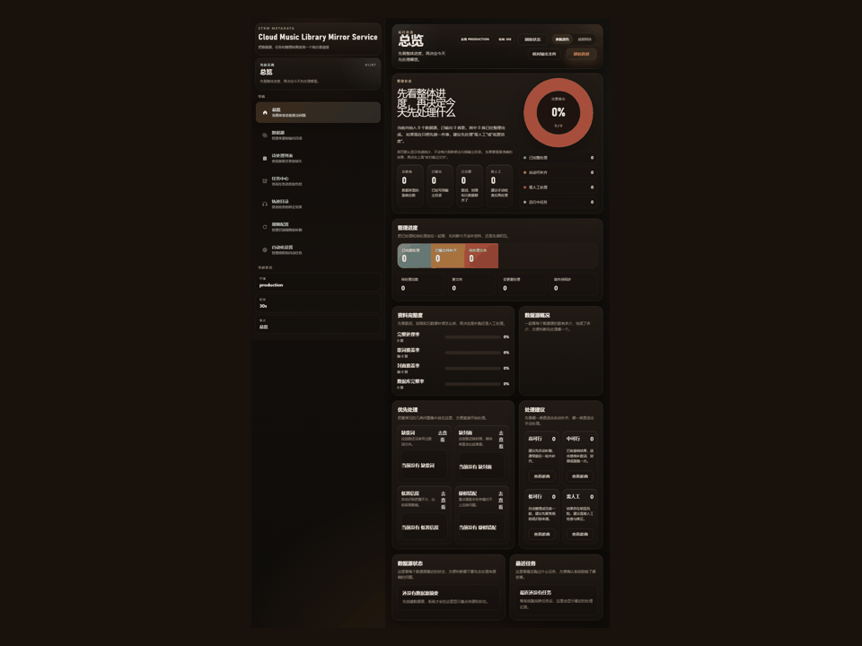
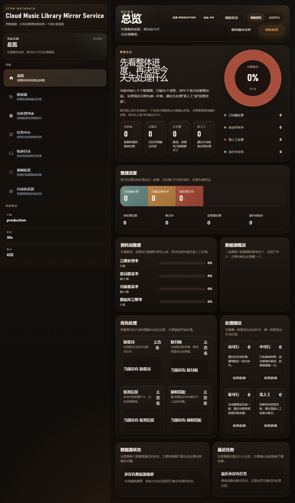
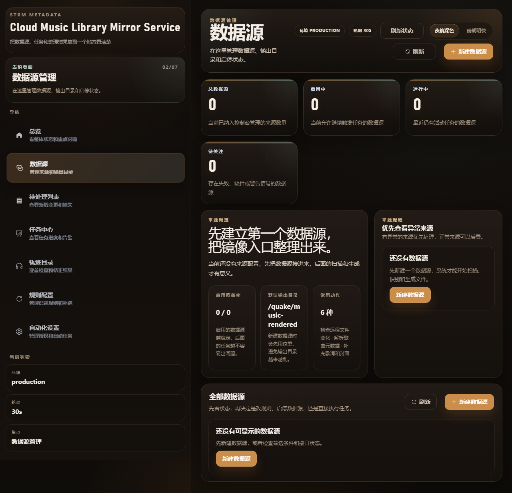
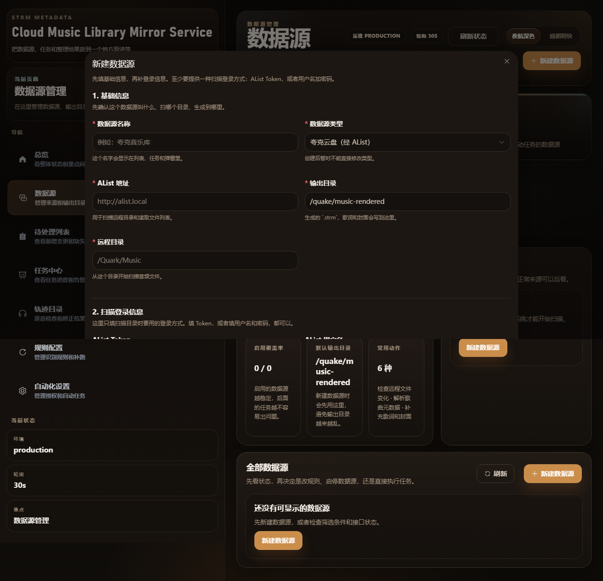
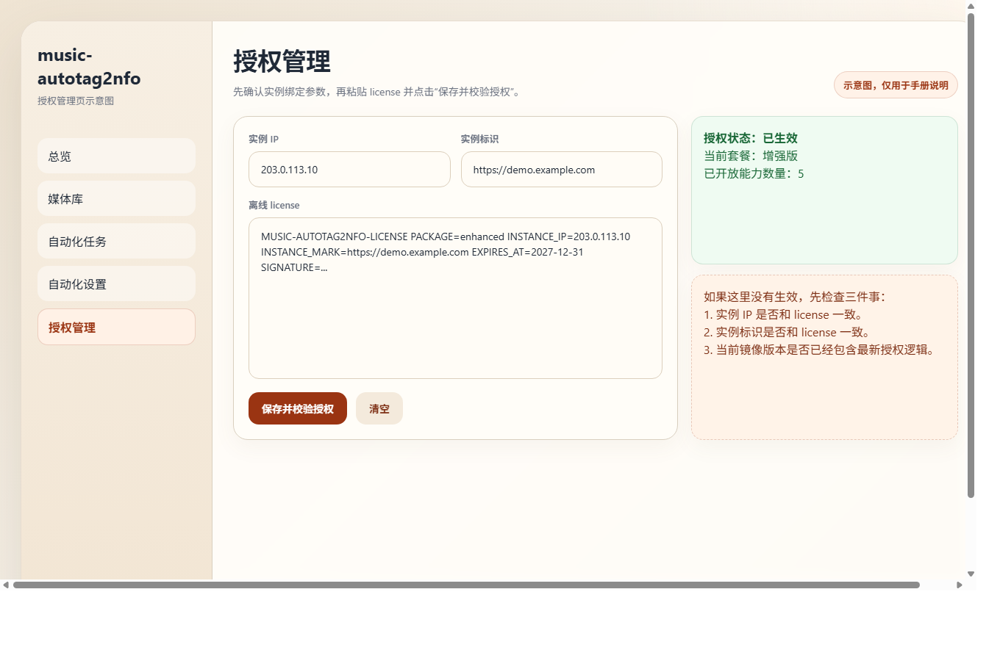

# 用户使用手册

这份手册按真实使用顺序来写。

你可以把它当成一条实际使用路径：
1. 先把服务跑起来
2. 打开控制台，看懂总览
3. 创建第一个数据源
4. 需要增强能力时，再录入 license
5. 以后就围绕总览、数据源、待处理列表和任务中心来用

## 演示视频

如果你想先快速看一遍界面和主要流程，可以先看这段演示：



## 1. 先知道你会怎么用它

这个控制台最适合的场景，是音乐文件放在远端，你希望在网页里把整理流程走完。

它不是拿来“改一首歌标签就退出”的。

更常见的用法是：
- 先把来源接进来
- 让系统扫描和整理
- 再回来看哪些结果已经够用，哪些要补资料，哪些值得人工确认

所以第一次上手时，不用急着把每个按钮都点一遍。先把最短路径跑通就行。

## 2. 把服务跑起来

默认访问地址：
- 控制台：`http://127.0.0.1:8000/app`
- 健康检查：`http://127.0.0.1:8000/api/healthz`

默认本地目录：
- `./data`

### 步骤 1：检查 [compose.yaml](../compose.yaml)

通常只需要看这几项：
- `image`
- `ports`
- `STRM_LICENSE_INSTANCE_IP`
- `STRM_LICENSE_INSTANCE_MARK`

如果你暂时还没启用增强版，后两个值先留空就行。

### 步骤 2：启动服务

```bash
docker compose up -d
```

### 步骤 3：确认服务正常

```bash
docker compose ps
python - <<'PY'
import urllib.request
print(urllib.request.urlopen('http://127.0.0.1:8000/api/healthz', timeout=10).read().decode())
PY
```

只要健康检查返回 `{"status":"ok", ...}`，就可以继续往下走。

## 3. 第一次打开后，先看总览

浏览器访问：
- <http://127.0.0.1:8000/app>

控制台首页实拍图：



第一次打开时，不用急着点很多地方。先看总览就够了。

建议按这个顺序看：
- `整理总览`
  - 先知道系统现在有没有纳入数据源、有没有实际输出内容
- `完整输出`
  - 看有多少结果已经完整处理
- `优先处理`
  - 这里会把缺歌词、缺封面、低置信度、疑似错配这类问题集中起来
- `处理建议`
  - 帮你判断哪些更适合自动补齐，哪些更值得人工处理

如果页面现在几乎全是 0，不代表坏了。多数时候只是因为你还没创建数据源。

## 4. 创建第一个数据源

### 步骤 1：进入 `数据源`

数据源管理页实拍图：



真正开始使用时，第一件大事通常不是改规则，也不是看任务，而是先把一个来源接进来。

这个页面里最值得先看的地方是：
- `来源概览`
  - 会直接提醒你先建立第一个数据源
- `全部数据源`
  - 以后这里会看到每个来源的状态、启停和异常情况
- `新建数据源`
  - 这是第一次接入的入口

### 步骤 2：点击 `新建数据源`

新建数据源抽屉实拍图：



第一次至少要填这些内容：
- `数据源名称`
  - 给自己一个以后看得懂的名字
- `数据源类型`
  - 当前常见的是“夸克云盘（经 AList）”
- `AList 地址`
  - 用于扫描远程目录和读取文件列表
- `输出目录`
  - 生成的 `.strm`、歌词和封面会写到这里
- `远程目录`
  - 从这个目录开始扫描音频文件

然后至少提供一种扫描登录方式：
- `AList Token`
或者
- `AList 用户名` + `AList 密码`

填完后点击：
- `保存并检查配置`

第一次建议保守一点。先把最少必填项跑通，等来源已经能正常扫描，再回头补渲染端信息、媒体服务器信息和处理策略。

## 5. 需要增强能力时，再录入 license

### 步骤 1：补齐绑定参数

编辑 [compose.yaml](../compose.yaml)，填写：
- `STRM_LICENSE_INSTANCE_IP`
- `STRM_LICENSE_INSTANCE_MARK`

建议同时把 `image` 固定到明确版本号。

说明：
- 官方镜像已经内置授权公钥
- 客户部署时不需要再额外挂载 `public.pem`

### 步骤 2：重启服务

```bash
docker compose up -d
```

### 步骤 3：进入 `自动化设置`

自动化设置页实拍图：



这个页面不只管授权，也管自动任务。

如果你是为了启用增强版，真正要看的区块是中间的：
- `授权管理`

你需要做的动作很简单：
1. 把 license 粘贴到 `授权码` 输入框
2. 点击 `保存并校验授权`

如果实例绑定参数和授权码一致，页面里的：
- `授权状态`
- `当前套餐`
- `已开放能力`

会从免费版状态切到已生效的增强版状态。

## 6. 日常使用时，最值得盯着的页面

当系统已经跑起来以后，你真正会反复用到的，通常不是安装命令，而是这些页面：

- `总览`
  - 每次先看这里，判断今天先清积压、补资料，还是手工修正
- `数据源`
  - 看哪些来源启用了，哪些来源异常，哪些值得先处理
- `待处理列表`
  - 看新增、缺失和变更重处理
- `任务中心`
  - 看最近跑了什么任务、哪里失败、哪里需要重试
- `轨迹目录`
  - 逐首复核结果，适合人工修正
- `规则配置`
  - 只有当你发现某一类识别总是不稳时，再来这里改

## 7. 升级与回滚

最稳的做法是：
1. 先备份 `./data`
2. 把 [compose.yaml](../compose.yaml) 里的 `image` 改成目标版本
3. 执行 `docker compose pull`
4. 执行 `docker compose up -d`

详细说明见：
- [升级与回滚](../deploy/upgrade.md)

## 8. 排障顺序

当你觉得“不太对”时，不要先猜前端问题。按这个顺序查：

1. `docker compose ps`
2. `docker compose logs -f`
3. `http://127.0.0.1:8000/api/healthz`
4. `http://127.0.0.1:8000/app`
5. 如果是增强版，再检查 license 绑定值和当前镜像版本

详细说明见：
- [常见问题排查](../faq/troubleshooting.md)
